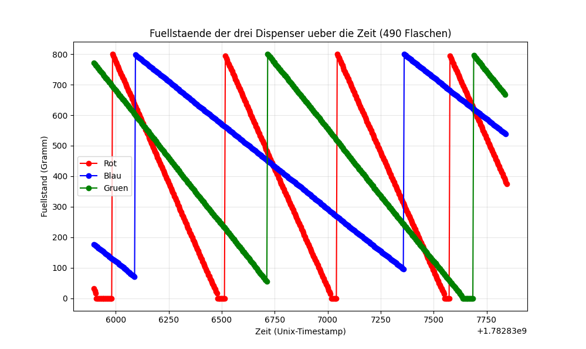
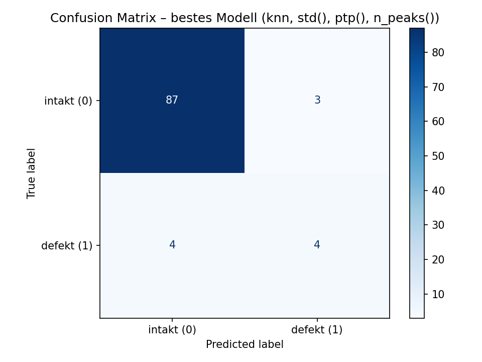

# IIoT Projekt – Simon und die starken Männer

**Kurs:** IIoT (Industrial Internet of Things) – MCI, Automatisierungstechnik
**Betreuer:** Lenard Wild
**Gruppe:** Simon und die starken Männer (Franz, Jäschke, Sextro)
**Abgabe:** 03.07.2026
**Gewichtung:** 25 % der Gesamtnote

## Überblick

Dieses Repository enthält alle vier Teilaufgaben des IIoT-Projektblocks,
basierend auf der TwinCAT-Learning-Factory-Simulation (Abfüll-/Etikettier-
station mit drei Dispensern, Förderband, Portalroboter und Waage):

| # | Aufgabe | Gewichtung | Status |
|---|---|---|---|
| [12.1.1](#1211-mqtt-client-in-twincat-20) | MQTT-Client in TwinCAT | 20 % | ✅ |
| [12.1.2](#1212-datenspeicherung--visualisierung-40) | Datenspeicherung & Visualisierung | 40 % | ✅ |
| [12.3](#123-regressionsmodell-für-endgewicht-20) | Regressionsmodell für Endgewicht | 20 % | ✅ |
| [12.4](#124-klassifikationsmodell-für-defekte-flaschen-20) | Klassifikationsmodell für defekte Flaschen | 20 % | ✅ |


## 12.1.1 MQTT-Client in TwinCAT (20 %)

Der Funktionsbaustein `FB_iot` verbindet sich über die Bibliothek
`Tc3_IotBase` (TF6701) mit dem Kurs-Broker und veröffentlicht periodisch
die Füllstände der drei Dispenser (rot, blau, grün) als MQTT-Nachrichten.

### Verbindungsaufbau

Beim ersten Zyklus (`first_cycle`) werden die Verbindungsdaten gesetzt:

| Parameter | Wert |
|---|---|
| Host | `158.180.44.197` |
| Port | `1883` |
| Topic-Prefix | `aut/SoSe26/SimonUndDieStarkenMaenner/` |
| Client-ID | `SimonUndDieStarkenMaenner-LF` |
| Benutzername / Passwort | `bobm` / `letmein` |

### Veröffentlichte Topics

**Einmalig beim Start (retained, mit `bQueue := TRUE`)**, getrennt von den
periodischen Messwerten über die Hilfsvariable `bStaticPublished`:

| Topic | Inhalt |
|---|---|
| `groupsname` | "Simon und die starken Männer" |
| `names` | Nachnamen der Gruppenmitglieder |
| `Fuellstand_rot$unit` / `_blau$unit` / `_gruen$unit` | jeweils `"g"` |

**Periodisch, alle 10 Sekunden** (`tmrSendMessageInterval`, retained):

| Topic | Inhalt |
|---|---|
| `Fuellstand_rot` | aktueller Füllstand Dispenser rot (`iUSS1`) |
| `Fuellstand_blau` | aktueller Füllstand Dispenser blau (`iUSS2`) |
| `Fuellstand_gruen` | aktueller Füllstand Dispenser grün (`iUSS3`) |

Alle Nachrichten werden mit `bRetain := TRUE` gesendet, damit auch ein
später hinzukommender Abonnent sofort den letzten
bekannten Wert sieht, ohne auf den nächsten Sendezyklus warten zu müssen.

### Einbindung in MAIN

```
// Deklaration:
fbiot : FB_iot;

// Aufruf, am Ende des Programmzyklus:
fbiot(iUSS1 := iOut_USS1, iUSS2 := iOut_USS2, iUSS3 := iOut_USS3);
```

`iOut_USS1/2/3` sind die bereits im Projekt vorhandenen Füllstandwerte
(siehe `MAIN`-Deklaration), die von den `FB_System_Fullstand`-Instanzen
(`fbExt1/2/3`) berechnet werden.

### Bekannte Einschränkungen

- Deutsche Umlaute (ä, ö, ü) werden im MQTT-Payload nicht korrekt
  encodiert dargestellt. Dies ist ein bekanntes, noch ungelöstes
  Encoding-Problem von TwinCAT-Strings und beeinträchtigt nicht die
  Funktionalität.

### Testen / Verifizieren

1. TwinCAT-Projekt einloggen und starten (beide Instanzen: `LF_System_PLC`
   und `PLC`)
2. Anlage über die Visualisierung mit `Enable` und `Execute` starten
3. Mit MQTT Explorer (oder einem anderen MQTT-Client) auf
   `158.180.44.197:1883` verbinden (Benutzername `bobm`, Passwort
   `letmein`)
4. Unter dem Topic-Pfad `aut/SoSe26/SimonUndDieStarkenMaenner/` sollten
   die oben beschriebenen Werte ankommen und sich alle 10 Sekunden
   aktualisieren

---

## 12.1.2 Datenspeicherung & Visualisierung (40 %)

Dieses Python-Programm verbindet sich mit dem Kurs-MQTT-Broker und empfängt
den Datenstrom der Learning Factory Simulation. Die eingehenden Nachrichten
werden pro Flasche zusammengeführt, in einer CSV-Datei gespeichert und live
als Diagramm visualisiert.

### Was das Programm macht

- Verbindet sich automatisch mit dem Broker (`158.180.44.197:1883`) und
  abonniert alle relevanten Topics der Simulation
- Alle eingehenden Nachrichten werden in einem Sicherheitsnetz-Log
  (`raw_messages.csv`) gespeichert
- Pro Flasche werden die Daten aller Topics (Füllstand, Vibration,
  Temperatur, Endgewicht, Schwingung beim Fall, Qualitätslabel) zu
  **einer Zeile** zusammengeführt und in `bottles.csv` gespeichert
- Ein Live-Plot zeigt die Füllstände aller drei Dispenser über die Zeit
  und **aktualisiert sich automatisch**, während neue Daten hereinkommen

### Datenstruktur `bottles.csv`

| Spalte | Bedeutung |
|---|---|
| `bottle` | Flaschen-ID (String) |
| `recipe` | Rezept-ID dieser Flasche |
| `time_red/blue/green` | Zeitstempel je Dispenser |
| `fill_level_grams_red/blue/green` | Füllstand je Farbe in Gramm |
| `vibration_index_red/blue/green` | Vibrationsindex je Dispenser |
| `temperature_red/blue/green` | Temperatur je Dispenser in °C |
| `time_final_weight`, `final_weight` | Zeitpunkt & Gewicht der Waage |
| `drop_oscillation` | Liste mit 500 Schwingungswerten als JSON-String |
| `is_cracked` | "0"/"1" – ob die Flasche beim Fall gesprungen ist |

### Setup & Ausführung

```bash
pip install -r requirements.txt

# 1. Daten sammeln (mindestens 15 Minuten, dann Strg+C zum Beenden)
python -m mqtt_client.mqtt_client

# 2. Live-Plot anzeigen (in einem zweiten Terminal, während Schritt 1 läuft)
python -m visualisierung.visualisierung
```

Die gesamte Konfiguration (Broker-Adresse, Zugangsdaten, Dateipfade) liegt
zentral in `config.py` und kann dort einfach angepasst werden.

### Ergebnis

Nach mindestens 15 Minuten Datensammlung sind alle relevanten Daten in
`data/bottles.csv` gespeichert. Der folgende Plot zeigt die Füllstände
aller drei Dispenser über die Zeit – rot, blau und grün entsprechen den
drei Abfüllstationen:



Das typische Sägezahn-Muster zeigt, wie jeder Tank kontinuierlich für viele
Flaschen genutzt wird (Füllstand sinkt), bis er leer ist und automatisch
wieder nachgefüllt wird (steiler Sprung nach oben).

### Zusatzaufgaben (Bonus)

Von den möglichen Bonus-Kriterien für 12.1.2 haben wir umgesetzt:

- **System über `config.py` konfigurierbar:** Broker-Adresse, Zugangsdaten,
  Topics und Dateipfade sind zentral in einer Konfigurationsdatei
  hinterlegt und können dort angepasst werden, ohne den restlichen Code
  zu verändern.
- **Fehlerbehandlung bei Verbindungsabbruch:** Der MQTT-Client verbindet
  sich bei einem Abbruch automatisch neu (siehe Abschnitt
  "Fehlerbehandlung" oben).

### Fehlerbehandlung

- Bei Verbindungsabbruch zum Broker wird automatisch erneut verbunden
- Ungültige Nachrichten werden übersprungen, ohne das Programm zu beenden
- Beim Beenden (Strg+C) werden noch offene, unvollständige
  Flaschen-Datensätze ebenfalls gespeichert und nicht verworfen

---

## 12.3 Regressionsmodell für Endgewicht (20 %)

Trainiert wird auf den in Aufgabe 12.1.2 gesammelten Daten (`bottles.csv`,
490 Flaschen, davon 488 mit vollständigem `final_weight`). Die restlichen 2
Zeilen (Flaschen, die beim Beenden des MQTT-Clients noch nicht fertig
durchgelaufen waren) wurden entfernt.

Für jede Spaltenkombination wurde:
1. Ein 80/20-Split in Trainings- und Testdaten durchgeführt
   (`train_test_split`, `random_state=42`)
2. Ein lineares Regressionsmodell (`sklearn.linear_model.LinearRegression`)
   trainiert
3. Der MSE (Mean Squared Error) sowohl auf den Trainings- als auch auf den
   Testdaten berechnet

### Ergebnisse

| Genutzte Spalten (`x`) | Modell-Typ | MSE (Training) | MSE (Test) | R² (Training) | R² (Test) |
|---|---|---|---|---|---|
| `fill_level_grams_red` | Linear | 30.79 | 27.35 | 0.13 | 0.21 |
| `fill_level_grams_red`, `vibration_index_red` | Linear | 3.72 | 2.60 | 0.90 | 0.92 |
| `fill_level_grams_red`, `vibration_index_red`, `temperature_red` | Linear | 3.97 | 1.58 | 0.89 | 0.95 |
| `fill_level_grams_red`, `fill_level_grams_blue`, `fill_level_grams_green` | Linear | 29.34 | 25.69 | 0.17 | 0.26 |
| **`fill_level_grams_red`, `fill_level_grams_blue`, `fill_level_grams_green`, `vibration_index_red`, `vibration_index_blue`, `vibration_index_green`** | **Linear** | **0.1104** | **0.1027** | **0.997** | **0.997** |
| `fill_level_grams_red`, `fill_level_grams_blue`, `fill_level_grams_green`, `vibration_index_red`, `vibration_index_blue`, `vibration_index_green`, `temperature_red`, `temperature_blue`, `temperature_green` | Linear | 0.1106 | 0.1044 | 0.997 | 0.997 |

### Bestes Modell

Die Kombination aller drei Füllstände und aller drei Vibrationsindizes
liefert mit deutlichem Abstand den niedrigsten Fehler (MSE Test = 0.1027,
R² Test = 0.997 – das Modell erklärt also 99,7 % der Varianz im
Endgewicht). Das Hinzufügen der Temperatur verbessert das Ergebnis nicht
weiter (MSE Test steigt leicht auf 0.1044) – die Füllstände und
Vibrationsindizes allein erklären das Endgewicht bereits nahezu
vollständig.

**Formel des besten Modells** (`y = mx + b`, hier mit mehreren `x`):

```
final_weight =
    0.0005 * fill_level_grams_red
  + 0.0004 * fill_level_grams_blue
  + 0.0006 * fill_level_grams_green
  + 0.0997 * vibration_index_red
  + 0.0762 * vibration_index_blue
  + 0.1001 * vibration_index_green
  - 3.4332
```

### Vorhersage für X.csv

Mit diesem besten Modell wurde die Vorhersage für den gemeinsamen
Prognose-Datensatz `X.csv` (247 Flaschen, ohne `final_weight`) erstellt und
in `reg_SimonUndDieStarkenMaenner.csv` gespeichert:

| Flaschen_ID | y_hat |
|---|---|
| 368 | 43.19 |
| 369 | 41.01 |
| 370 | 41.47 |
| 371 | 18.17 |
| 372 | 17.15 |

### Setup & Ausführung

```bash
pip install -r requirements.txt
python regression.py
```

Voraussetzung: `bottles.csv` (aus 12.1.2) und `X.csv` (vom Kurs
bereitgestellt) liegen im selben Ordner wie `regression.py`.

---

## 12.4 Klassifikationsmodell für defekte Flaschen (20 %)

### Ziel

Vorhersage, ob eine Flasche beim Vereinzeln beschädigt wurde (`is_cracked`,
0 = intakt, 1 = defekt), anhand der Vibrationsdaten beim Fall
(`drop_oscillation`, 500 Messwerte je Flasche als JSON-Array).

### Vorgehen

1. **Datenbasis:** Aus `bottles.csv` wurden alle Flaschen mit vollständigem
   `drop_oscillation`- und `is_cracked`-Wert verwendet: **488 Datensätze**,
   davon **41 defekt (≈ 8,4 %)** und 447 intakt. Die Klassen sind damit
   deutlich unbalanciert.

2. **Feature Engineering:** Da ein Modell nicht sinnvoll mit 500 rohen
   Zeitreihenwerten pro Flasche arbeiten kann, wurden daraus statistische
   Kennzahlen berechnet. Laut `1_Leistungsbewertung.md` sind dabei
   **RMS, Mean, STD, Min, Max, Range und Median** als Basis-Features
   gefordert; zusätzlich wurden eigene, ergänzende Merkmale getestet:
   - Pflicht: `RMS`, `Mean`, `STD`, `Min`, `Max`, `Range` (= ptp = max−min), `Median`
   - Ergänzend: Anzahl der Nulldurchgänge (grobes Frequenzmaß), Anzahl
     echter Peaks/Ausschläge (`scipy.signal.find_peaks`), Signalenergie
     (Summe der Quadrate), mittlerer Betrag

3. **Modelle:** Getestet wurden **kNN** (k-Nearest-Neighbors, k=7,
   distanzgewichtet) und **Logistische Regression** (mit
   `class_weight="balanced"` wegen der Klassenungleichheit), jeweils auf
   verschiedenen Feature-Kombinationen — darunter explizit auch die
   geforderte Pflicht-Feature-Kombination. Die Daten wurden vorab mit
   `StandardScaler` skaliert (wichtig v. a. für kNN, da es auf Distanzen
   zwischen Punkten basiert).

4. **Split:** 80 % Training / 20 % Test, stratifiziert nach `is_cracked`,
   damit auch im kleinen Testset genügend defekte Flaschen enthalten sind.

5. **Bewertung:** Wegen der starken Klassenungleichheit wäre reine
   Accuracy irreführend (ein Modell, das immer "intakt" vorhersagt, käme
   bereits auf ~91 % Accuracy). Daher wird stattdessen der **F1-Score**
   für die Klasse "defekt" sowie die **Confusion Matrix** herangezogen.

### Ergebnisse

| Genutzte Features | Modell-Typ | F1-Score (Training) | F1-Score (Test) |
|---|---|---|---|
| mean() | kNN | 1.000 | 0.333 |
| mean(), std() | kNN | 1.000 | 0.364 |
| mean(), std() | Log. Regression | 0.216 | 0.136 |
| RMS, Mean, STD, Min, Max, Range, Median (Pflicht-Features) | kNN | 1.000 | 0.222 |
| RMS, Mean, STD, Min, Max, Range, Median (Pflicht-Features) | Log. Regression | 0.214 | 0.145 |
| std(), ptp(), n_peaks() | **kNN (bestes Modell)** | 1.000 | **0.533** |
| std(), ptp(), n_peaks(), energy() | kNN | 1.000 | 0.533 |
| alle statist. Features (inkl. RMS, Median) | Log. Regression | 0.219 | 0.145 |
| alle statist. Features (inkl. RMS, Median) | kNN | 1.000 | 0.182 |

**Bestes Modell:** kNN (k=7, distanzgewichtet) mit den Features
`std()`, `ptp()` und `n_peaks()` — F1-Score (Test) = **0,533**.

> **Hinweis zum Trainings-F1 von 1.0:** Da kNN mit distanzbasierter
> Gewichtung arbeitet, ist ein Trainingspunkt bei der Vorhersage sein
> eigener nächster Nachbar mit (nahezu) unendlichem Gewicht — das Modell
> "lernt" die Trainingsdaten dadurch auswendig. Das ist ein bekanntes,
> normales Verhalten von kNN und kein Fehler. Die aussagekräftige Kennzahl
> ist der F1-Score auf den Testdaten.

### Confusion Matrix (bestes Modell, Testdaten)



|              | Predicted: 0 (intakt) | Predicted: 1 (defekt) |
|--------------|:----------------------:|:-----------------------:|
| **Actual: 0** | 87 | 3 |
| **Actual: 1** | 4 | 4 |

### Interpretation

Von den 8 tatsächlich defekten Flaschen im Testset wurden 4 korrekt
erkannt (True Positives), 4 wurden übersehen (False Negatives). Nur 3
intakte Flaschen wurden fälschlich als defekt eingestuft (False
Positives). Angesichts von nur 41 defekten Flaschen in den gesamten
Trainingsdaten ist das ein akzeptables Ergebnis, zeigt aber auch die
Grenzen der Methode: Mit mehr Trainingsdaten (insbesondere mehr
defekten Flaschen) und feineren Merkmalen aus der Zeitreihe (z. B.
Frequenzanalyse per FFT) ließe sich die Erkennung vermutlich weiter
verbessern.

### Datei

Das vollständige Skript befindet sich in [`classification.py`](classification.py).

---

---

## Hinweis zum Einsatz von KI-Unterstützung

Bei diesem Projekt wurde teilweise Claude (Anthropic) als Hilfsmittel
eingesetzt – vor allem zum **Debuggen** (Fehlersuche in TwinCAT- und
Python-Code), zum **Erklären** von Konzepten (z. B. Confusion Matrix,
F1-Score, MQTT/TF6701-Bibliothek) und zur **Strukturierung/Formulierung**
dieser Dokumentation. Ein Teil der Code-Schnipsel (u. a. Teile von
`classification.py`) wurde mit Unterstützung von Claude erstellt und
anschließend von uns überprüft, angepasst und getestet; andere Teile
(z. B. `FB_iot`, Teile der Datenpipeline) haben wir selbst geschrieben.
Verstanden und verantwortet wird der gesamte eingereichte Code von der
Gruppe.

